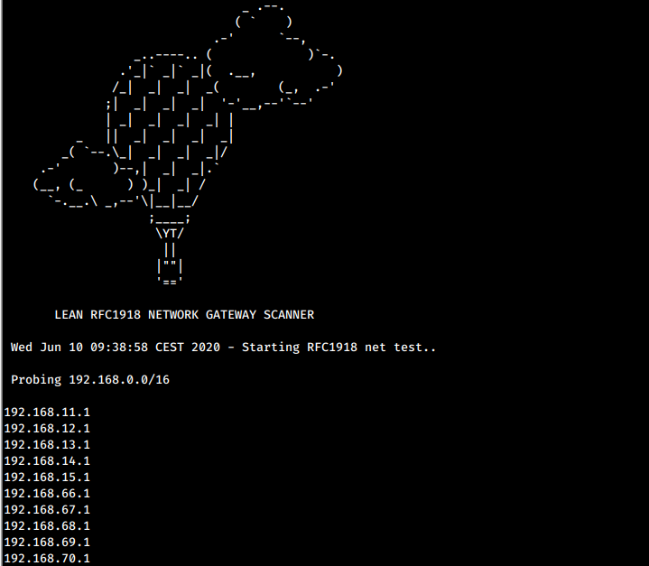

Netfinder is a script that uses fping to quickly determin if all private networks gateways exist

Prerequisites: 
apt-get install parallel fping 

### Thanks Ole Tange I personally LOVE this utility (parallel)

Run the scanner
./netfinder.sh  | tee found_nets_alive.txt

Example:

 Note:
 - if the gateway does not answers icmp echo / ping then you will not "see" it 
 - if the networks gateways are not .1 but .2 or something else you will have to alter the script.

 Disclamer:
 - Running this script will affect network performance but only for some minutes..

